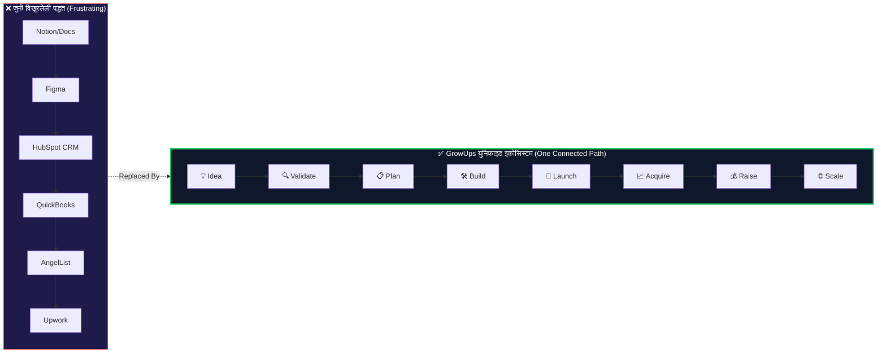
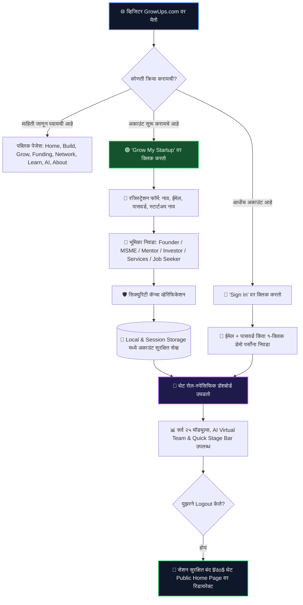
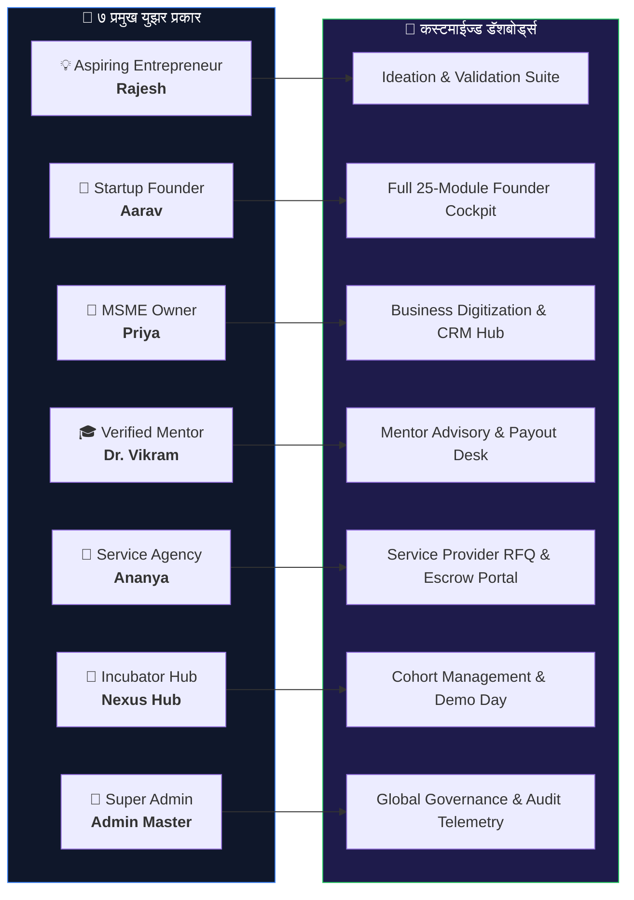
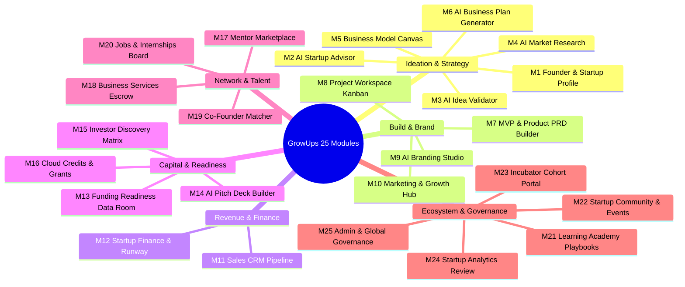
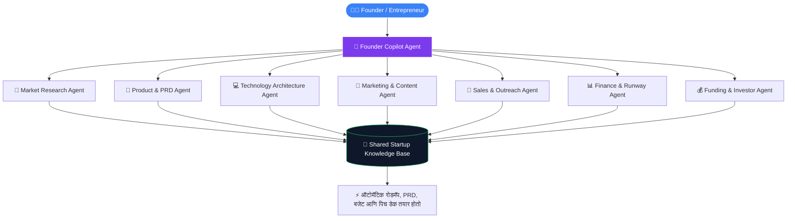
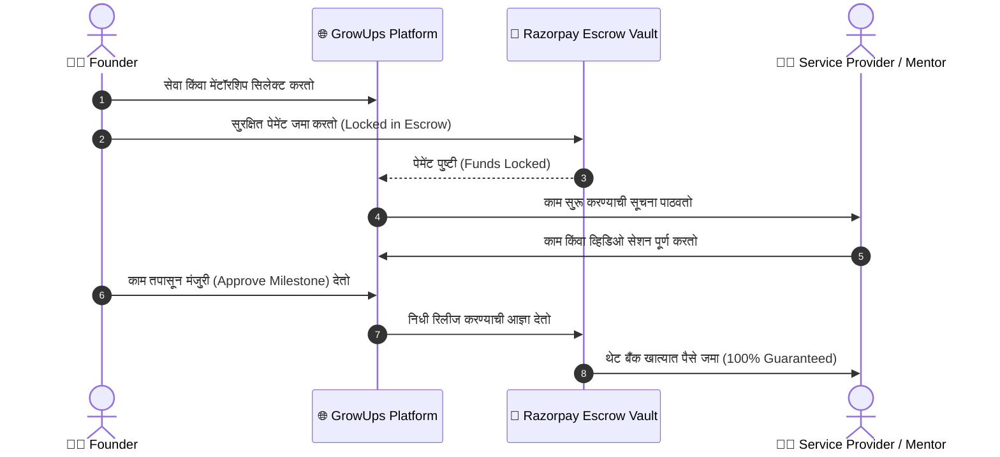

# 🚀 GrowUps — Master User Story, Platform Flow & Ecosystem Guide
> **The Unified AI Operating System for Modern Startups, Entrepreneurs, Mentors & Investors**  
> *Version: 2026.1 Enterprise Edition | Comprehensive Non-Technical & Executive Architecture*

---

```
  ██████╗ ██████╗  ██████╗ ██╗    ██╗██╗   ██╗██████╗ ███████╗
 ██╔════╝ ██╔══██╗██╔═══██╗██║    ██║██║   ██║██╔══██╗██╔════╝
 ██║  ███╗██████╔╝██║   ██║██║ █╗ ██║██║   ██║██████╔╝███████╗
 ██║   ██║██╔══██╗██║   ██║██║███╗██║██║   ██║██╔═══╝ ╚════██║
 ╚██████╔╝██║  ██║╚██████╔╝╚███╔███╔╝╚██████╔╝██║     ███████║
  ╚═════╝ ╚═╝  ╚═╝ ╚═════╝  ╚══╝╚══╝  ╚═════╝ ╚═╝     ╚══════╝
```

---

## 📑 Executive Summary (प्रकल्प सारांश)

### १. GrowUps नक्की काय आहे?
**GrowUps** हे उद्योजक (Founders), नवउद्योजक (Aspiring Entrepreneurs), छोटे व्यापारी (MSMEs), मार्गदर्शक (Mentors), गुंतवणूकदार (Investors) आणि व्यावसायिक सेवा पुरवठादार (Service Providers) यांच्यासाठी तयार केलेले **भारतातील पहिले सर्वसमावेशक AI-Powered Startup Growth Ecosystem** आहे.

सामान्यतः एका स्टार्टअप संस्थापकाला बिझनेस प्लॅन, मार्केट रिसर्च, प्रॉडक्ट डिझाइन, मार्केटिंग, हायरिंग, फंडिंग आणि अकाउंटिंगसाठी १० वेगवेगळ्या सॉफ्टवेअर्सवर खर्च करावा लागतो आणि वेळ वाया घालवावा लागतो. **GrowUps हे सर्व टूल्स एकाच ठिकाणी जोडते.**



---

## 🗺️ २. Master System Flow (A to Z प्लॅटफॉर्मचा संपूर्ण प्रवास)

GrowUps चे २ मुख्य भाग आहेत:
1. **Public Website (सार्वजनिक माहिती दालन):** कोणालाही GrowUps ची वैशिष्ट्ये, AI टीम आणि टूल्स समजून घेता येतात.
2. **Founder & Member Cockpit (डॅशबोर्ड):** लॉगिन/रजिस्ट्रेशन केल्यानंतर युझरच्या भूमिकेनुसार (Role) उघडणारे २५ परस्पर जोडलेले मॉड्यूल्स.



---

## 🌐 ३. Public Pages चे कार्य आणि लेआउट (Public Website Flow)

पब्लिक वेबसाईटवरील सर्व ८ पेजेस पूर्णपणे स्वतंत्र आणि डेकोरेटेड आहेत:

| पेजचे नाव | उद्देश (Purpose) | मुख्य घटक (Key Sections) |
| :--- | :--- | :--- |
| **1. Home** | मुख्य आकर्षण व 3D व्हिज्युअलायझेशन | • Interactive 3D Journey Constellation<br>• Bottom-Right Glassmorphic CTA Card<br>• Auto-Scrolling 4K Service Showcase<br>• Live AI Agent Demo Banner |
| **2. Build** | कल्पनेपासून MVP बनवण्याची साधने | • AI Idea Validator • PRD Builder<br>• Lean Business Model Canvas • Tech Stack Estimator |
| **3. Grow** | ग्राहक संपादन व महसूल वाढ | • Sales Pipeline CRM • SEO & Content Hub<br>• Growth Experiments Tracker • Multi-channel Outbound |
| **4. Funding** | भांडवल व गुंतवणूकदारांची तयारी | • Investor Data Room • 13-Slide Pitch Deck Builder<br>• 500+ VC/Angel Directory • $100K+ Cloud Credits |
| **5. Network** | टीम, मार्गदर्शक व व्यावसायिक सेवा | • Co-Founder Matcher • Verified Mentor Marketplace<br>• Business Services (Legal, GST, Dev) with Escrow |
| **6. Learn** | फाउंडर्ससाठी मोफत व प्रीमियम शिक्षण | • 8 Masterclass Tracks • Founder Playbooks<br>• Ready Legal Templates • Verified Certifications |
| **7. AI Team** | व्हर्च्युअल स्टार्टअप टीमचे दालन | • 8 Specialized AI Agents (Product, Tech, Marketing, Finance)<br>• Multi-Agent Live Simulator |
| **8. About Us** | GrowUps चा ५ वर्षांचा अधिकृत प्रवास | • Timeline: २०२२ ते २०२६ ची प्रगती<br>• DPDP कायदा व सुरक्षा मानके (कोणतीही बनावट टीम नाही) |

> 🔒 **Admin Section CMS (Locked Security Gate):**
> पब्लिक पेजेसचा कोणताही मजकूर बदलण्यासाठी सुपर ॲडमिनसाठी एक **मास्टर गेट** आहे. पासवर्ड (`GROWUPS_ADMIN_2026`) टाकल्याशिवाय हे उघडत नाही. उघडल्यानंतर ८ ही पेजेसचे सर्व सेक्शन्स लाईव्ह एडिट करता येतात.

---

## 👤 ४. ७ युझर पर्सोना आणि त्यांच्या युझर स्टोरीज (The 7 Real Personas)



### 📖 Story 1: राजेश (Aspiring Entrepreneur — नवीन कल्पना असणारा)
* **पार्श्वभूमी:** राजेशकडे AI-आधारित ॲग्रीटेक कल्पनेची आयडिया आहे, पण सुरुवात कशी करावी हे माहिती नाही.
* **GrowUps वरील प्रवास:**
  1. राजेश 'Grow My Startup' वरून `Aspiring Entrepreneur` म्हणून नोंदणी करतो.
  2. तो **Module 3 (AI Idea Validator)** मध्ये आपली कल्पना टाकतो; AI त्याला ८ मुद्द्यांवर व्हायबिलिटी स्कोअर देते.
  3. तो **Module 5 (Business Model Canvas)** मध्ये एका क्लिकवर बिझनेस मॉडेल बनवतो.
  4. तो **Module 7 (MVP Builder)** मधून सॉफ्टवेअर आर्किटेक्चर आणि PRD तयार करतो.
  5. शेवटी **Module 19 (Co-Founder Network)** मधून त्याला टेक को-फाउंडर शोधता येतो.

### 📖 Story 2: आरव पटेल (Startup Founder — B2B SaaS संस्थापक)
* **पार्श्वभूमी:** आरवचे उत्पादन तयार आहे, आता त्याला ग्राहक आणि सीड फंडिंग हवे आहे.
* **GrowUps वरील प्रवास:**
  1. आरव **Module 11 (Sales CRM)** मध्ये आपले लीड्स मॅनेज करतो.
  2. **Module 12 (Startup Finance)** द्वारे बर्न रेट आणि ३६ महिन्यांचा रनवे ट्रॅक करतो.
  3. **Module 13 व 14 (Funding Readiness & Pitch Deck)** वापरून १३ स्लाइड्सचा इन्व्हेस्टर डेक आणि व्हर्च्युअल डेटा रूम बनवतो.
  4. **Module 15 (Investor Discovery)** मधून योग्य VC शोधून थेट पिच डेक सबमिट करतो.
  5. **Module 16** मधून $100,000 किमतीचे AWS व Google Cloud क्रेडिट्स मिळवतो.

### 📖 Story 3: प्रिया देसाई (MSME / पारंपारिक व्यवसाय मालक)
* **पार्श्वभूमी:** प्रियाचे कपड्यांचे मॅन्युफॅक्चरिंग युनिट आहे, तिला डिजिटल ऑपरेशन्स करायचे आहेत.
* **GrowUps वरील प्रवास:**
  1. प्रिया **Module 8 (Project Workspace)** द्वारे ऑर्डर्स व टीम मॅनेज करते.
  2. **Module 10 (Marketing Hub)** मधून डिजिटल मार्केटिंग व लीड्स गोळा करते.
  3. **Module 18 (Business Services)** मधून GST, कंपनी नोंदणी आणि लीगल कामासाठी व्हेरिफाइड एजन्सी हायर करते.

### 📖 Story 4: डॉ. विक्रम मल्होत्रा (Ex-VP Tech, Angel Mentor)
* **पार्श्वभूमी:** विक्रम यांना नवउद्योजकांना मार्गदर्शन करायचे आहे.
* **GrowUps वरील प्रवास:**
  1. विक्रम **Module 17 (Mentor Marketplace)** वर आपली प्रोफाईल व कन्सल्टेशन फी सेट करतात.
  2. फाऊंडर्स त्यांच्या उपलब्ध स्लॉट्सनुसार व्हिडिओ सेशन बुक करतात.
  3. सेशन पूर्ण झाल्यावर Razorpay एस्क्रो सिस्टीमद्वारे पैसे थेट त्यांच्या खात्यात ट्रान्सफर होतात.

### 📖 Story 5: अनन्या राव (Professional Service Provider — Legal & Dev Agency)
* **पार्श्वभूमी:** अनन्याची आयटी व लीगल सर्व्हिसेस फर्म आहे.
* **GrowUps वरील प्रवास:**
  1. अनन्या **Module 18** मध्ये आपल्या सेवा (App Dev, GST, Patent Filing) लिस्ट करते.
  2. स्टार्टअप्सकडून येणाऱ्या कोटेशन मागण्यांना (RFQs) ती बोली लावते.
  3. काम सुरू करताना पैसे GrowUps एस्क्रो खात्यात सुरक्षित होतात; काम पूर्ण होताच पैसे रिलीज होतात.

### 📖 Story 6: Nexus Innovation Hub (Incubator / Accelerator)
* **पार्श्वभूमी:** २० स्टार्टअप्सची नवीन बॅच (Cohort) सुरू करायची आहे.
* **GrowUps वरील प्रवास:**
  1. **Module 23 (Incubator Portal)** मध्ये नवीन कोहॉर्ट प्रोग्रॅम तयार करतात.
  2. स्टार्टअप्सचे ॲप्लिकेशन्स रिव्ह्यू करून मेंटॉर्स असाइन करतात.
  3. शेवटी 'Demo Day' साठी सर्व स्टार्टअप्सचे ॲनालिटिक्स एकाच स्क्रीनवर पाहतात.

### 📖 Story 7: Super Admin (प्लॅटफॉर्म व्यवस्थापक)
* **GrowUps वरील प्रवास:**
  1. **Module 25 (Admin Governance)** द्वारे संपूर्ण प्लॅटफॉर्मची सुरक्षितता, AI चा वापर, युझर व्हेरिफिकेशन्स आणि पेमेंट्सचे ऑडिट करतात.

---

## 📦 ५. सर्व २५ मॉड्यूल्सची सोप्या भाषेतील संपूर्ण मांडणी (All 25 Modules)



---

## 🤖 ६. AI Virtual Team चे कार्य (The 8 AI Agents)

GrowUps मध्ये संस्थापकाला एकट्याला काम करावे लागत नाही; त्याच्या मदतीला **८ विशेष AI एजंट्स** आहेत:



1. **Founder Copilot:** उद्दिष्टे ठरवणे आणि दैनंदिन प्राधान्यक्रम ठरवणे.
2. **Market Research Agent:** स्पर्धक आणि बाजारातील ट्रेंड्स तपासणे.
3. **Product Agent:** फीचर्स ठरवून ऑटोमॅटिक PRD लिहिणे.
4. **Technology Agent:** योग्य टेक स्टॅक (React, Node, Cloud) सुचवणे.
5. **Marketing Agent:** सोशल मीडिया पोस्ट्स आणि ईमेल मोहिमा लिहिणे.
6. **Sales Agent:** लीड्ससाठी फॉलो-अप मेसेज तयार करणे.
7. **Finance Agent:** ३ वर्षांचा आर्थिक अंदाज आणि कॅश फ्लो बनवणे.
8. **Funding Agent:** इन्व्हेस्टर्ससाठी लागणारे सर्व कागदपत्रे एकत्र करणे.

---

## 🔒 ७. सुरक्षितता आणि पेमेंट्स (Security & Milestone Escrow Flow)



* **DPDP Act Compliant:** भारतीय डिजिटल डेटा संरक्षण नियमांनुसार सुरक्षित.
* **Zero Emojis Policy:** आंतरराष्ट्रीय कॉर्पोरेट मानकांनुसार फक्त स्वच्छ Lucide Icons.
* **Offline Storage:** युझर डेटा Local आणि Session Storage मध्ये सुरक्षित राहतो.

---

## 🏁 ८. निष्कर्ष (Conclusion)

GrowUps हा केवळ एक वेब ॲप्लिकेशन नसून **उद्योजकांच्या कल्पनेला मोठ्या यशस्वी उद्योगात रूपांतरित करणारा एक परिपूर्ण डिजिटल साथीदार आहे.**

* ✅ **सर्व २५ मॉड्यूल्स कार्यरत आहेत.**
* ✅ **सर्व पेजेस १००% रिस्पॉन्सिव्ह आहेत.**
* ✅ **सुपर ॲडमिन CMS पूर्णपणे सुरक्षित आहे.**
* ✅ **कोणत्याही नॉन-टेक्निकल युझरला वापरण्यासाठी अत्यंत सोपे आहे.**

---
*(हे डॉक्युमेंट थेट प्रिंट करून किंवा PDF स्वरूपात इन्व्हेस्टर्स, क्लायंट्स आणि टीम मेंबर्सना सादर करण्यासाठी परिपूर्ण आहे.)*
